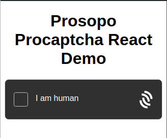

# procaptcha-react-webpack

Demo showing how to use Procaptcha React components with Webpack. The `ProcaptchaFrictionless` component is used in a
simple React App. This component will require a normal user to complete a Proof-of-Work captcha, or an image captcha if
the user is likely to be a bot. See
the [client-example](https://github.com/prosopo/captcha/blob/87631d223796264cd168bf06d5e149aa0ca2f5e9/demos/client-example/src/App.tsx#L222-L227)
for other React component examples.

## Setup

```bash
npm install
```

Replace the site key in `src/App.js` with your own site key.

```typescript
    const config = {
        account: {
             // Enter your SITE_KEY here. This one is a demo key.
            address: '5C4hrfjw9DjXZTzV3MwzrrAr9P1MJhSrvWGWqi1eSuyUpnhM',
        },
    };
```

## Run

```bash
npm run start
```

Go to http://localhost:9000 in your browser.


